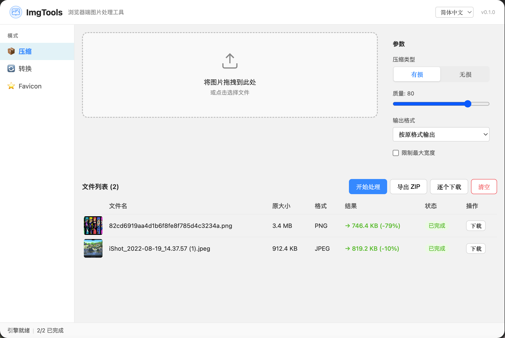

# ImgTools

> 纯浏览器端图片处理工具 — 压缩 & 格式转换，无需上传服务器。




## 功能

- **图片压缩** — JPEG/PNG/WebP/AVIF/TIFF 有损/无损压缩，质量可调
- **格式转换** — JPEG/PNG/WebP/AVIF/BMP/TIFF 互转
- **批量处理** — 多图同时处理，ZIP 打包下载或逐个下载
- **自动降质** — 确保压缩后文件真正变小
- **隐私安全** — 所有处理在浏览器本地完成，文件不上传

## 快速开始

```bash
npm install
npm run dev
```

打开 http://localhost:5173 即可使用。

## 构建

```bash
npm run build     # 类型检查 + 生产构建
npx vite build    # 仅构建（跳过类型检查）
```

## 部署

本项目可部署到任何静态托管服务：

### Vercel

[](https://vercel.com/new)

或使用 CLI：

```bash
npx vercel --prod
```

> ⚠️ 务必保留 COOP/COEP 头（配置见 `vercel.json`），否则 wasm-vips 无法运行。

## 技术原理

- **图像引擎**: [wasm-vips](https://github.com/kleisauke/wasm-vips) — libvips 的 WebAssembly 移植
- **编码方式**: libvips 内联格式字符串，如 `.jpg[Q=80,optimize_coding=true]`
- **跨域隔离**: 需要 `Cross-Origin-Opener-Policy: same-origin` + `Cross-Origin-Embedder-Policy: require-corp`
- **WASM 大小**: ~5 MB（首次加载后浏览器缓存）

### GitHub Pages

推送到 `main` 分支自动触发构建部署。

> ⚠️ GitHub Pages 不支持自定义 HTTP 头，COOP/COEP 无法设置，因此 wasm-vips **在 GitHub Pages 上无法正常工作**。建议使用 Vercel 部署（完整支持 COOP/COEP）。

## 项目结构

```
src/
├── core/         # 核心引擎
├── composables/  # 逻辑层
├── stores/       # 状态管理
├── components/   # UI 组件
└── utils/        # 工具函数
```

## 许可

MIT
